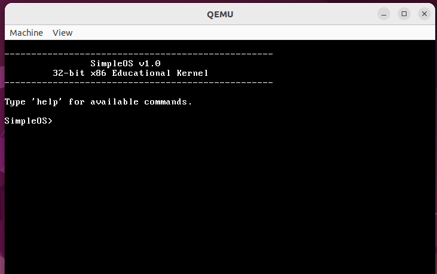

# Version

v1.0-stable

# SimpleOS – 32-bit x86 Educational Kernel

## Overview
SimpleOS is a minimal 32-bit x86 educational operating system kernel written in C and Assembly.  
It boots in protected mode and demonstrates core OS concepts including interrupt handling, hardware drivers, memory management, and a custom command-line shell.

---

## Features
- Bootable 32-bit x86 kernel
- Interrupt Descriptor Table (IDT) setup
- PIC remapping & hardware IRQ handling
- Programmable Interval Timer (PIT)
- PS/2 Keyboard Driver
- VGA Text Mode Driver
- Custom command-line shell
- In-memory file system
- Basic kernel heap with block coalescing

---

## Shell Commands
```
help
clear 
echo <text>
uptime 
version 
ls 
cat <filename>
```
---
## Architecture
```
Bootloader 
↓ Kernel 
├── IDT 
├── PIC 
├── PIT 
├── Keyboard Driver 
├── VGA Driver 
├── Shell 
└── In-memory FS
```
---
## How to Run
```bash
make
qemu-system-i386 -kernel kernel.bin

---
## Demo

